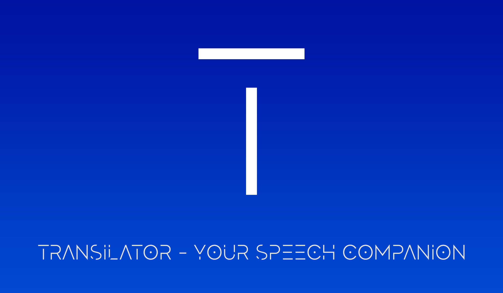
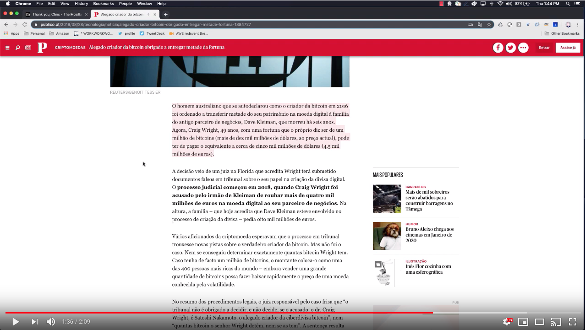

## Transilator Chrome Extension

### Features

- Turns highlighted text into lifelike speech
- Text translation to language of your choice (arabic, english, chinese, dutch, spanish, portugese, danish, hindi, italian, japanese, korean, norwegian, polish, russian, swedish, turkish)
- Language detection (dutch, portugese, english, italian, french, spanish)

### Applications
- Learning a new language
- Listening to a news article, documentation, or blog post
- Reviewing a blog post / tweet before publishing it
- Users with vision problems / accessibility related use cases
- Listening to emails
- Listening to content from other languages

### Demo

[](https://www.youtube.com/watch?v=R90uQ_LrpE0)

### Services used

This app uses Amazon Comprehend to interpret the language of the text, Amazon Translate for translation of the text, and Amazon Polly for voice synthesization of the text.

## Getting started

1. Clone the project and install the dependencies:

```sh
git clone https://github.com/dabit3/transilator.git

cd transilator

npm install
```

2. Initialize the Amplify project:

```sh
amplify init
```

3. Deploy the resources:

```sh
amplify push --y
```

4. Build the bundle

```sh
npm run build
```

5. Upload the extension to chrome

- Visit chrome://extensions (menu -> settings -> Extensions).
- Enable Developer mode by ticking the checkbox in the upper-right corner.
- Click on the "Load unpacked extension..." button.
- Select the directory containing your unpacked extension.

